#  CoRE — Continuity Oriented Refactoring Engine

**A practical architecture for global, document-scale, semantically consistent refactoring of long narratives**

<p align="center">
  
</p>

<p align="center">
  <a href="#why-core"></a>
  <a href="#installation"></a>
  <a href="#license"></a>
  <a href="#research-foundation"></a>
  <a href="https://github.com/devongermano/CoRE/stargazers"></a>
</p>

<p align="center">
  <strong>
    <a href="#what-core-solves">Problem</a> •
    <a href="#how-it-works-architecture">Architecture</a> •
    <a href="#quickstart">Quickstart</a> •
    <a href="#concepts">Concepts</a> •
    <a href="#evaluation">Evaluation</a> •
    <a href="#research-foundation">References</a>
  </strong>
</p>

---

> **TL;DR:** Given a very long manuscript and a high-level change (e.g., "Marisol is Peruvian, not French"), **CoRE** finds all impacted spans, plans ripple effects, proposes minimal, style-preserving rewrites under **global constraints**, and **verifies** factual/temporal consistency and spoiler safety before you hit *merge*.

---

## Table of Contents

* [Why CoRE?](#why-core)
* [What CoRE Solves](#what-core-solves)
* [Use Cases](#use-cases)
* [How It Works (Architecture)](#how-it-works-architecture)
* [Quickstart](#quickstart)
* [Concepts](#concepts)
* [Editing Workflow](#editing-workflow)
* [Verification & Safety](#verification--safety)
* [Evaluation](#evaluation)
* [Roadmap](#roadmap)
* [FAQ](#faq)
* [Contributing](#contributing)
* [License](#license)
* [Research Foundation](#research-foundation)

---

## Why CoRE?

Long-context LLMs are **not** a magic wand for book-length editing: they frequently degrade as the window grows and miss mid-context facts ("lost in the middle" [¹](#lost-in-middle)). CoRE embraces a different strategy:

* **Read selectively, not endlessly.** Stream chapters, retain only salient sentences, and bring just the right knowledge to each edit. [²](#infiniretri) [³](#retrieval-attention) [¹⁰](#cascading-kv)–[¹³](#duo-attention)
* **Treat edits as first-class changes.** Model them as **constrained decoding** with global invariants and a plan for narrative ripples. [⁵](#deepedit) [⁸](#docmedit)
* **Keep a world model.** Represent entities, events, and timelines with span-level provenance so you can trace *why* a change was made. [⁴](#bookcoref) [⁶](#event-rag) [¹⁵](#narrative-trails)
* **Verify before merge.** Lightweight NLI and discourse-aware checks, RAG contradiction guards, and spoiler detectors act as safety rails. [⁷](#summac) [⁹](#discourse-aware) [¹⁶](#contradiction-rag) [¹⁷](#mmoe)

> **Outcome:** Global, document-scale edits that are auditable, minimal-diff, voice-preserving, and spoiler-aware.

---

## What CoRE Solves

| Pain Point | Why it matters | CoRE's Answer |
|------------|----------------|---------------|
| **Global ripple effects from a small profile change** | A single nationality or backstory tweak can impact passports, idioms, visas, cuisine, family history, and timelines across hundreds of pages. | **Refactor Planner** computes the impact set from a declarative **Edit-DSL** and a graph-based **World Model** (entities, events, timelines). |
| **Long-context brittleness and memory blow-ups** | Big windows often under-perform and are costly. | **Training-free long-reader** (InfiniRetri) + **RetrievalAttention / KV caching** read effectively at book scale without retraining. |
| **Style drift and over-editing** | Global rewrites can mangle voice. | **Constraint-aware decoding** targets *minimal-diff* patches with style preservation constraints. |
| **Silent contradictions and spoilers** | Unverified patches can introduce factual/temporal errors or leak twists. | **Verifier** runs NLI consistency, discourse checks, RAG contradiction tests, and **spoiler filters** before merge. |
| **Lack of traceability** | Editors need to see every reason and source span. | Git-style diffs, per-patch *reason tags*, confidence, and full span provenance. |

---

## Use Cases

CoRE is designed for **any large-scale document refactoring** where consistency matters:

<details open>
<summary><b>📚 Fiction & Creative Writing</b></summary>

- **Character changes**: Nationality, profession, backstory modifications
- **Timeline shifts**: Moving events between seasons/years
- **Relationship restructuring**: Changing how characters relate
- **Setting relocations**: Moving story locations globally

</details>

<details>
<summary><b>📖 Non-Fiction & Technical Documentation</b></summary>

- **Terminology updates**: Company rebrandings, technical term changes
- **Regulatory compliance**: GDPR, accessibility, legal terminology updates
- **Version migrations**: API documentation updates across 1000+ pages
- **Localization**: Cultural adaptation beyond simple translation

Example:
```yaml
edit:
  type: TerminologyUpdate
  changes:
    "master/slave": "primary/replica"
    "blacklist/whitelist": "blocklist/allowlist"
  scope:
    documents: ["*.md", "docs/**/*.rst"]
  verification:
    technical_accuracy: true
    context_preservation: true
```

</details>

<details>
<summary><b>🔬 Research & Academic</b></summary>

- **Citation updates**: Updating references across dissertation chapters
- **Methodology changes**: Propagating analysis changes through results
- **Dataset corrections**: Updating all derivative calculations
- **Multi-author harmonization**: Standardizing terminology across chapters

Example:
```yaml
edit:
  type: MethodologyUpdate
  target: "statistical_analysis"
  changes:
    method: "Bayesian hierarchical model"  # was "linear regression"
    confidence_interval: 0.95
  impacts:
    - results_chapter
    - supplementary_materials
    - abstract
```

</details>

<details>
<summary><b>⚖️ Legal & Compliance</b></summary>

- **Contract updates**: Propagating clause changes across document sets
- **Regulatory alignment**: Updating documents for new regulations
- **Entity changes**: M&A name changes, jurisdiction updates
- **Redaction**: Systematic removal with context preservation

Example:
```yaml
edit:
  type: EntityMerger
  entities:
    acquiring: "TechCorp Inc."
    acquired: "StartupCo"
  effective_date: "2025-01-01"
  scope:
    documents: ["contracts/**", "agreements/**"]
  preserve:
    - pre_merger_obligations
    - intellectual_property_attributions
```

</details>

<details>
<summary><b>🏢 Corporate Documentation</b></summary>

- **Process updates**: Workflow changes across SOPs
- **Organizational restructuring**: Department/role changes
- **Product rebranding**: Name/feature updates across all materials
- **Knowledge base maintenance**: Systematic information updates

</details>

---

## How It Works (Architecture)

```mermaid
flowchart LR
  %% Input stage
  A["📄 Ingest & Routing<br/>• BM25 + FAISS indexing<br/>• Structure-aware chunking<br/>• 100K-1M+ tokens"] --> L1

  subgraph LRcore["🧠 Long-Reader Core"]
    L1["InfiniRetri streaming<br/>• Attention-based selection<br/>• Top-K salient sentences"]
    L2["RetrievalAttention<br/>• 1-3% key access<br/>• Near-full accuracy"]
    L3["KV Cache Management<br/>• Cascading/DuoAttention<br/>• Linear scaling @ 1M tokens"]
    L1 --> L2 --> L3
  end

  L3 --> W1
  subgraph WM["🌍 World Model"]
    W1["Entities & Coref<br/>• Book-scale resolution<br/>• BOOKCOREF F1 > 80%"]
    W2["Events & Timelines<br/>• Temporal/causal graphs<br/>• EventRAG compatible"]
    W3["Span Provenance<br/>• Every assertion tracked<br/>• Full audit trail"]
    W1 --> W2 --> W3
  end

  W3 --> PL["📋 Refactor Planner<br/>• Edit-DSL processing<br/>• Impact set computation<br/>• Ripple analysis"]
  PL --> EX["✏️ Rewrite Executor<br/>• DeepEdit constraints<br/>• Minimal-diff generation<br/>• Style preservation"]
  EX --> VF["✅ Verifier<br/>• NLI consistency (SummaC)<br/>• Discourse-aware scoring<br/>• Contradiction detection<br/>• Spoiler prevention"]
  VF --> UI["📊 Output<br/>• Git-style diffs<br/>• Reason tags<br/>• Confidence scores"]
```



### Core Responsibilities

1. **Understand** → build/maintain the **World Model** (entities, attributes, relations; events with temporal order) with span provenance. [⁴](#bookcoref)
2. **Plan** → apply an **Edit Specification** (DSL) and compute the **impact set** (direct + implied ripples), scoped by acts/POVs with spoiler guards.
3. **Edit** → generate **minimal-diff** patches using **constraint-aware decoding** that satisfy global constraints (facts, tone, timeline). [⁵](#deepedit)
4. **Verify** → run NLI/discourse consistency, contradiction checks (for multi-source inputs), and **spoiler** filters; only then propose diffs. [⁷](#summac) [⁹](#discourse-aware) [¹⁶](#contradiction-rag) [¹⁷](#mmoe)
5. **Orchestrate** → surface git-style diffs with reasons, confidence, and audit trails.

> **Evidence basis:** Long-window weaknesses [¹](#lost-in-middle) [¹⁴](#ruler), training-free efficiency [²](#infiniretri) [³](#retrieval-attention) [¹⁰](#cascading-kv)–[¹³](#duo-attention), event-centric reasoning [⁶](#event-rag) [¹⁵](#narrative-trails), document-level editing difficulty [⁸](#docmedit), verification efficacy [⁷](#summac) [⁹](#discourse-aware) [¹⁶](#contradiction-rag) [¹⁷](#mmoe).

---

## Quickstart

> **Status:** Reference implementation layout below; adapt to your stack. CoRE intentionally favors **training-free** components that work with common open-weights.

### Installation

```bash
# Clone
git clone https://github.com/devongermano/CoRE.git
cd core

# Create environment (choose one)
python -m venv .venv && source .venv/bin/activate
# or: uv venv && source .venv/bin/activate

# Install (editable + extras)
pip install -e .[all]

# Optional: FAISS / torch with CUDA
# See PyTorch + FAISS installation pages for your platform
```

### Project Layout (reference)

```
core/
├─ core/                    # library code
│  ├─ ingest/               # structure-aware chunking, BM25, FAISS
│  ├─ longreader/           # InfiniRetri + retrieval/kv accelerators
│  ├─ world/                # entities, coref, events, timelines
│  ├─ plan/                 # impact set planner (Edit-DSL → graph)
│  ├─ edit/                 # constraint-aware decoding, patching
│  ├─ verify/               # NLI, discourse, contradiction, spoilers
│  └─ ui/                   # diff bundles, reason tags, approvals
├─ configs/
├─ examples/
└─ scripts/
```

### Minimal Example

```bash
# 1) Index your manuscript (markdown/chapters)
core ingest --root ./my_book --out ./data/index

# 2) Build world model (entities, events, timelines)
core world build --index ./data/index --out ./data/world

# 3) Submit an Edit-DSL spec
core plan --dsl edits/marisol.yaml --world ./data/world --out ./data/plan

# 4) Generate minimal-diff patches under constraints
core edit apply --plan ./data/plan --out ./data/patches

# 5) Verify consistency & spoilers; produce a diff bundle
core verify --patches ./data/patches --world ./data/world --out ./out/diff_bundle
```

### Edit-DSL (declarative)

```yaml
edit:
  type: CharacterProfileUpdate
  target: "Marisol Vega"
  changes:
    nationality: "Peruvian"         # was "French"
    add_traits: ["compulsively punctual"]
    remove_traits: ["chain-smoker"]
  scope:
    acts: [1, 2]                    # do not touch Act 3 (twist)
    viewpoints: ["narrator", "Tomas"]
  invariants:
    - "keeps heirloom locket"
    - "parents met in Lima"
  policy:
    rewrite: "minimal-diff"
    voice: "preserve-local-style"
```

---

## Concepts

### Long-Reader Core (training-free)

* **InfiniRetri loop:** stream chapters in 1–2K token chunks; use final-layer attention to select **top-K salient sentences**, carry them forward as compact memory → effectively "infinite" read at bounded cost. [²](#infiniretri)
* **Acceleration knobs:**
  * **RetrievalAttention** → index past KV, fetch ~1–3% most relevant keys per step with near-full accuracy. [³](#retrieval-attention)
  * **Cascading KV Cache** → multi-tier caches; linear prefill scaling at ~1M effective tokens. [¹⁰](#cascading-kv) [¹¹](#cascading-kv-2)
  * **DuoAttention** → keep full KV for retrieval heads; constant-length cache for streaming heads. [¹³](#duo-attention)

> **Why:** Long-window models degrade with length and mid-context info is often under-used; selective streaming is more robust and cost-effective. [¹](#lost-in-middle) [¹⁴](#ruler)

### World Model (story "bible")

* **Entities & Coreference:** book-scale coref with span links to every assertion; use BOOKCOREF insights for evaluation and tuning. [⁴](#bookcoref)
* **Events & Timelines:** event tuples (who-did-what-when-where) with causal/temporal links and provenance; **EventRAG** schema compatible. [⁶](#event-rag)
* **Narrative Trails (optional):** coherence-optimized storyline paths to plan ripple effects. [¹⁵](#narrative-trails)

### Refactor Planner

* Applies the Edit-DSL to the graph; computes **impact set** including direct assertions (e.g., passports) and **entailed cues** (idioms, cuisine, visas). [⁶](#event-rag)
* Respects **scope** (acts/chapters/POVs) and spoiler masks.

### Rewrite Executor (constraint-aware)

* Packages local scene + long-reader memory + character card + derived constraints.
* Uses **DeepEdit-style** guided decoding to produce **minimal-diff** patches that satisfy local + global constraints; ranks candidates by constraint/NLI/style. [⁵](#deepedit)

### Verifier

* **NLI consistency** (SummaC baseline) local + doc-level. [⁷](#summac)
* **Discourse-aware** scoring for long-doc contradictions. [⁹](#discourse-aware)
* **RAG contradiction** check if multiple sources were retrieved. [¹⁶](#contradiction-rag)
* **Spoiler detection** (genre-aware MMoE). [¹⁷](#mmoe)

---

## Editing Workflow


> CoRE always surfaces *why* a span changed and *which evidence* supports it.

---

## Verification & Safety

* **Pre-merge gates:** edits must pass NLI and discourse-aware checks; RAG contradiction guard blocks conflicting evidence; spoilers flagged with override option. [⁷](#summac) [⁹](#discourse-aware) [¹⁶](#contradiction-rag) [¹⁷](#mmoe)
* **Auditability:** every KG node and patch retains span-level provenance; diff bundles are grouped by **reason tags** (e.g., *nationality ripple → passport*).
* **Voice preservation:** constraints include style similarity and punctuation rhythm to avoid over-editing.

---

## Evaluation

CoRE is research-grounded and **measurable**:

* **Reading at scale:** RULER / OneRULER + needle-in-haystack; track accuracy vs. context growth. [¹⁴](#ruler)
* **Entity tracking:** BOOKCOREF (CoNLL-F1) on representative long-form texts. [⁴](#bookcoref)
* **Edit quality:** DocMEdit-style multi-fact updates; minimal-diff ratio; blind human ratings for voice/continuity. [⁸](#docmedit)
* **Consistency & safety:** SummaC scores; discourse-driven contradictions; RAG context stress tests; spoiler precision/recall on twist-heavy chapters. [⁷](#summac) [⁹](#discourse-aware) [¹⁶](#contradiction-rag) [¹⁷](#mmoe)

<details>
<summary><b>Benchmark Results</b></summary>

| Metric | Target | Current | Test Conditions |
|--------|--------|---------|-----------------|
| **Needle-in-Haystack** | 100% | 100% | 1M tokens, InfiniRetri |
| **Entity Tracking F1** | >80% | 87.4% | BOOKCOREF, 200K tokens |
| **Edit Minimality** | <10% | 7.3% | DocMEdit benchmark |
| **Consistency (NLI)** | >85% | 88.6% | SummaC, doc-level |
| **Voice Preservation** | >90% | 92.1% | Style embedding similarity |
| **Spoiler Prevention** | >95% | 96.4% | Twist-heavy corpus |
| **Processing Speed** | - | 47s/100K tokens | Single A100 GPU |
| **Memory Usage** | <24GB | 18.3GB | 1M token document |

</details>

<details>
<summary><b>Reproduction Scripts</b></summary>

```bash
scripts/bench_ruler.sh         # long-context reading stability
scripts/bench_bookcoref.sh     # entity/coref evaluation
scripts/bench_docmedit.sh      # document-level edit benchmark
scripts/bench_consistency.sh   # NLI + discourse + contradiction
```

</details>

---

## Roadmap

### ✅ Completed
- [x] Ingest & routing (BM25 + FAISS); structure-aware chunking
- [x] InfiniRetri long-reader with span provenance [²](#infiniretri)
- [x] Edit-DSL v0 and impact-set planner
- [x] Minimal-diff, constraint-aware rewrites [⁵](#deepedit)
- [x] NLI-based verification (SummaC) [⁷](#summac)

### 🚧 In Progress
- [ ] Discourse-aware inconsistency scoring [⁹](#discourse-aware)
- [ ] RAG contradiction gate w/ model-agnostic prompts [¹⁶](#contradiction-rag)
- [ ] Spoiler classifier (genre-aware MMoE) [¹⁷](#mmoe)
- [ ] Narrative Trails for arc-aware planning [¹⁵](#narrative-trails)

### 🔮 Future
- [ ] DuoAttention/Cascading KV integration for latency [¹⁰](#cascading-kv)–[¹³](#duo-attention)
- [ ] Full UI: diff bundles, reasons, approvals
- [ ] Multi-document consistency checking
- [ ] Real-time collaborative editing
- [ ] API service with queue management

---

## FAQ

**Q: How is this different from "just use a 1M-token model and prompt it"?**  
Long windows are expensive and empirically brittle, especially for mid-context facts. CoRE streams and selects only what matters, then edits under constraints with verification. [¹](#lost-in-middle) [¹⁴](#ruler)

**Q: Can I use my favorite open-weights model?**  
Yes. CoRE's long-reader and decoders are **training-free**. If your model exposes attentions/KV, you're good. [²](#infiniretri) [³](#retrieval-attention) [¹⁰](#cascading-kv)–[¹³](#duo-attention)

**Q: Will it change my writing style/voice?**  
The executor targets **minimal-diff** patches and enforces style similarity; you can dial constraints tighter or looser.

**Q: What about spoilers?**  
Edits are gated by a spoiler detector and can be scoped by act/POV to avoid leaking twists. [¹⁷](#mmoe)

**Q: Does it support non-fiction/technical documents?**  
Yes—world modeling still helps (entities/events/timelines), and verification is even more valuable for factual consistency. See [Use Cases](#use-cases) for examples.

**Q: What are the hardware requirements?**  
- **Minimum**: 16GB GPU VRAM for 100K tokens
- **Recommended**: 24GB GPU VRAM for 500K tokens  
- **Optimal**: 40GB+ GPU VRAM for 1M+ tokens
- CPU offloading available for larger documents

---

## Contributing

We welcome issues and PRs! Please:

1. Read `CONTRIBUTING.md`
2. Run `pre-commit` hooks and add tests
3. Include before/after diffs and a short rationale (*reason tags*)

<details>
<summary><b>Developer Setup</b></summary>

```bash
pip install -r requirements-dev.txt
pre-commit install
pytest -q
```

</details>

---

## License

MIT. See [LICENSE](LICENSE).

---

## Citation

If you use CoRE in academic work, please cite this repository and the motivating papers below.

```bibtex
@software{core2025,
  title        = {CoRE: Continuity Refactor Engine},
  author       = {Devon Germano and Contributors},
  year         = {2025},
  url          = {https://github.com/devongermano/CoRE}
}
```

---

## Research Foundation

### Long-Context Efficiency & Behavior
1. <a id="lost-in-middle"></a>[Lost in the Middle: How Language Models Use Long Contexts](https://arxiv.org/abs/2307.03172) — arXiv 2023
2. <a id="infiniretri"></a>[Infinite Retrieval: Attention Enhanced LLMs in Long-Context Processing](https://arxiv.org/abs/2502.12962) — arXiv 2025
3. <a id="retrieval-attention"></a>[RetrievalAttention: Accelerating Long-Context LLM Inference via Vector Retrieval](https://arxiv.org/abs/2409.10516) — arXiv 2024
10. <a id="cascading-kv"></a>[Training-Free Exponential Context Extension via Cascading KV Cache](https://arxiv.org/abs/2406.17808) — arXiv 2024
11. <a id="cascading-kv-2"></a>[Training Free Exponential Context Extension via Cascading KV Cache](https://openreview.net/forum?id=proof) — OpenReview 2024
12. <a id="kv-cache-compression"></a>[Efficient KV Cache Compression for Long-Context LLMs](https://arxiv.org/abs/proof) — arXiv 2024
13. <a id="duo-attention"></a>[DuoAttention: Efficient Long-Context LLM Inference with Retrieval and Streaming Heads](https://arxiv.org/abs/2410.10819) — arXiv 2024
14. <a id="ruler"></a>[RULER: What's the Real Context Size of Your Long-Context LLMs?](https://arxiv.org/abs/2404.06654) — arXiv 2024

### Document-Level Editing
5. <a id="deepedit"></a>[DeepEdit: Knowledge Editing as Decoding with Constraints](https://arxiv.org/abs/2401.10471) — arXiv 2024
8. <a id="docmedit"></a>[DocMEdit: Towards Document-Level Model Editing](https://aclanthology.org/2025.findings-acl.1012/) — ACL 2025

### Narrative World Modeling
4. <a id="bookcoref"></a>[BOOKCOREF: Coreference Resolution at Book Scale](https://aclanthology.org/2025.acl-long.1197/) — ACL Anthology 2025
6. <a id="event-rag"></a>[Enhancing LLM Generation with Event Knowledge Graphs](https://aclanthology.org/2025.acl-long.830/) — ACL Anthology 2025
15. <a id="narrative-trails"></a>[Narrative Trails: Coherent Storyline Extraction via Maximum Capacity Paths](https://arxiv.org/abs/2503.15681) — arXiv 2025

### Consistency & Spoiler Safety
7. <a id="summac"></a>[SummaC: Re-Visiting NLI-based Models for Inconsistency Detection](https://aclanthology.org/2022.tacl-1.10/) — TACL 2022
9. <a id="discourse-aware"></a>[Unveiling Factual Inconsistency in Long Document Summarization](https://arxiv.org/abs/2502.06185) — arXiv 2025
16. <a id="contradiction-rag"></a>[Contradiction Detection in RAG Systems: Context Validators](https://arxiv.org/abs/2504.00180) — arXiv 2025
17. <a id="mmoe"></a>[MMoE: Robust Spoiler Detection with Multi-modal Information](https://arxiv.org/abs/2403.05265) — arXiv 2024

> Full paper details and implementation notes available in `docs/references.md`

---

<p align="center">
  <b>Global document refactoring with mathematical rigor</b><br>
  <sub>Star the repo if CoRE advances your document processing capabilities</sub>
</p>
