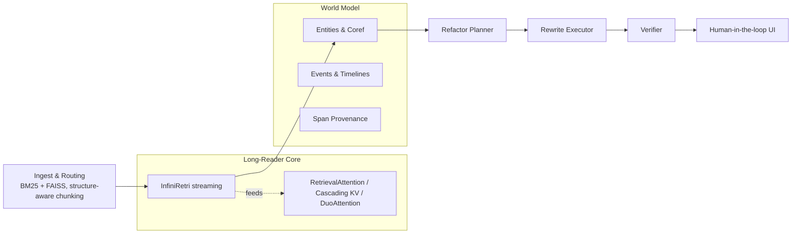
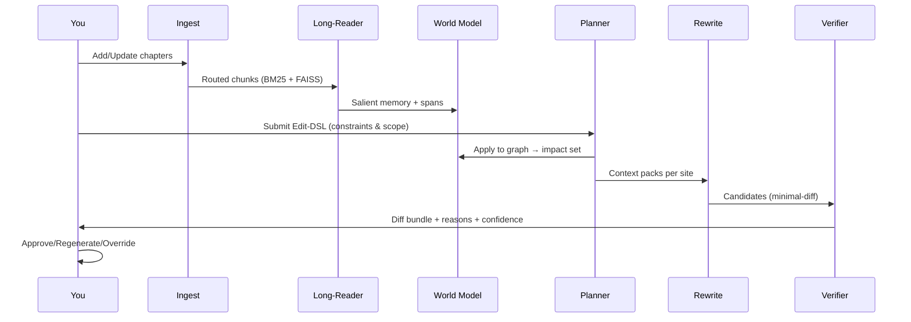

# CoRE — Continuity Refactor Engine

*A practical architecture for global, document‑scale, semantically consistent refactoring of long narratives*

<p align="center">
  <a href="#why-core"></a>
  <a href="#installation"></a>
  <a href="#license"></a>
  <a href="#references"></a>
</p>

> **One‑liner:** Given a very long manuscript and a high‑level change (e.g., “Marisol is Peruvian, not French”), **CoRE** finds all impacted spans, plans ripple effects, proposes minimal, style‑preserving rewrites under **global constraints**, and **verifies** factual/temporal consistency and spoiler safety before you hit *merge*.

---

## Table of Contents

* [Why CoRE?](#why-core)
* [What CoRE Solves](#what-core-solves)
* [How It Works (Architecture)](#how-it-works-architecture)
* [Quickstart](#quickstart)
* [Concepts](#concepts)
* [Editing Workflow](#editing-workflow)
* [Verification & Safety](#verification--safety)
* [Evaluation](#evaluation)
* [Roadmap](#roadmap)
* [FAQ](#faq)
* [Contributing](#contributing)
* [License](#license)
* [References](#references)

---

## Why CoRE?

Long‑context LLMs are **not** a magic wand for book‑length editing: they frequently degrade as the window grows and miss mid‑context facts ("lost in the middle"). CoRE embraces a different strategy:

* **Read selectively, not endlessly.** Stream chapters, retain only salient sentences, and bring just the right knowledge to each edit. \[1, 2, 10–14]
* **Treat edits as first‑class changes.** Model them as **constrained decoding** with global invariants and a plan for narrative ripples. \[5, 8]
* **Keep a world model.** Represent entities, events, and timelines with span‑level provenance so you can trace *why* a change was made. \[3, 4, 15]
* **Verify before merge.** Lightweight NLI and discourse‑aware checks, RAG contradiction guards, and spoiler detectors act as safety rails. \[6, 7, 9, 16]

> **Outcome:** Global, document‑scale edits that are auditable, minimal‑diff, voice‑preserving, and spoiler‑aware.

---

## What CoRE Solves

| Pain Point                                        | Why it matters                                                                                                                                | CoRE’s Answer                                                                                                                                 |
| ------------------------------------------------- | --------------------------------------------------------------------------------------------------------------------------------------------- | --------------------------------------------------------------------------------------------------------------------------------------------- |
| Global ripple effects from a small profile change | A single nationality or backstory tweak can impact passports, idioms, visas, cuisine, family history, and timelines across hundreds of pages. | **Refactor Planner** computes the impact set from a declarative **Edit‑DSL** and a graph‑based **World Model** (entities, events, timelines). |
| Long‑context brittleness and memory blow‑ups      | Big windows often under‑perform and are costly.                                                                                               | **Training‑free long‑reader** (InfiniRetri) + **RetrievalAttention / KV caching** read effectively at book scale without retraining.          |
| Style drift and over‑editing                      | Global rewrites can mangle voice.                                                                                                             | **Constraint‑aware decoding** targets *minimal‑diff* patches with style preservation constraints.                                             |
| Silent contradictions and spoilers                | Unverified patches can introduce factual/temporal errors or leak twists.                                                                      | **Verifier** runs NLI consistency, discourse checks, RAG contradiction tests, and **spoiler filters** before merge.                           |
| Lack of traceability                              | Editors need to see every reason and source span.                                                                                             | Git‑style diffs, per‑patch *reason tags*, confidence, and full span provenance.                                                               |

---

## How It Works (Architecture)



### Core Responsibilities

1. **Understand** → build/maintain the **World Model** (entities, attributes, relations; events with temporal order) with span provenance. \[3]
2. **Plan** → apply an **Edit Specification** (DSL) and compute the **impact set** (direct + implied ripples), scoped by acts/POVs with spoiler guards.
3. **Edit** → generate **minimal‑diff** patches using **constraint‑aware decoding** that satisfy global constraints (facts, tone, timeline). \[8]
4. **Verify** → run NLI/discourse consistency, contradiction checks (for multi‑source inputs), and **spoiler** filters; only then propose diffs. \[6, 7, 9]
5. **Orchestrate** → surface git‑style diffs with reasons, confidence, and audit trails.

> **Evidence basis:** Long‑window weaknesses \[1, 14], training‑free efficiency \[2, 10–13], event‑centric reasoning \[3, 4], document‑level editing difficulty \[5], verification efficacy \[6, 7, 9, 16].

---

## Quickstart

> **Status:** Reference implementation layout below; adapt to your stack. CoRE intentionally favors **training‑free** components that work with common open‑weights.

### Installation

```bash
# Clone
git clone https://github.com/your-org/core.git
cd core

# Create environment (choose one)
python -m venv .venv && source .venv/bin/activate
# or: uv venv && source .venv/bin/activate

# Install (editable + extras)
pip install -e .[all]

# Optional: FAISS / torch with CUDA
# See PyTorch + FAISS installation pages for your platform
```

### Project Layout (reference)

```
core/
├─ core/                    # library code
│  ├─ ingest/               # structure-aware chunking, BM25, FAISS
│  ├─ longreader/           # InfiniRetri + retrieval/kv accelerators
│  ├─ world/                # entities, coref, events, timelines
│  ├─ plan/                 # impact set planner (Edit-DSL → graph)
│  ├─ edit/                 # constraint-aware decoding, patching
│  ├─ verify/               # NLI, discourse, contradiction, spoilers
│  └─ ui/                   # diff bundles, reason tags, approvals
├─ configs/
├─ examples/
└─ scripts/
```

### Minimal Example

```bash
# 1) Index your manuscript (markdown/chapters)
core ingest --root ./my_book --out ./data/index

# 2) Build world model (entities, events, timelines)
core world build --index ./data/index --out ./data/world

# 3) Submit an Edit-DSL spec
core plan --dsl edits/marisol.yaml --world ./data/world --out ./data/plan

# 4) Generate minimal-diff patches under constraints
core edit apply --plan ./data/plan --out ./data/patches

# 5) Verify consistency & spoilers; produce a diff bundle
core verify --patches ./data/patches --world ./data/world --out ./out/diff_bundle
```

### Edit‑DSL (declarative)

```yaml
edit:
  type: CharacterProfileUpdate
  target: "Marisol Vega"
  changes:
    nationality: "Peruvian"         # was "French"
    add_traits: ["compulsively punctual"]
    remove_traits: ["chain-smoker"]
  scope:
    acts: [1, 2]                    # do not touch Act 3 (twist)
    viewpoints: ["narrator", "Tomas"]
  invariants:
    - "keeps heirloom locket"
    - "parents met in Lima"
  policy:
    rewrite: "minimal-diff"
    voice: "preserve-local-style"
```

---

## Concepts

### Long‑Reader Core (training‑free)

* **InfiniRetri loop:** stream chapters in 1–2K token chunks; use final‑layer attention to select **top‑K salient sentences**, carry them forward as compact memory → effectively “infinite” read at bounded cost. \[2]
* **Acceleration knobs:**

  * **RetrievalAttention** → index past KV, fetch \~1–3% most relevant keys per step with near‑full accuracy. \[10]
  * **Cascading KV Cache** → multi‑tier caches; linear prefill scaling at \~1M effective tokens. \[11, 12]
  * **DuoAttention** → keep full KV for retrieval heads; constant‑length cache for streaming heads. \[13]

> **Why:** Long‑window models degrade with length and mid‑context info is often under‑used; selective streaming is more robust and cost‑effective. \[1, 14]

### World Model (story “bible”)

* **Entities & Coreference:** book‑scale coref with span links to every assertion; use BOOKCOREF insights for evaluation and tuning. \[15]
* **Events & Timelines:** event tuples (who‑did‑what‑when‑where) with causal/temporal links and provenance; **EventRAG** schema compatible. \[3]
* **Narrative Trails (optional):** coherence‑optimized storyline paths to plan ripple effects. \[4]

### Refactor Planner

* Applies the Edit‑DSL to the graph; computes **impact set** including direct assertions (e.g., passports) and **entailed cues** (idioms, cuisine, visas). \[3]
* Respects **scope** (acts/chapters/POVs) and spoiler masks.

### Rewrite Executor (constraint‑aware)

* Packages local scene + long‑reader memory + character card + derived constraints.
* Uses **DeepEdit‑style** guided decoding to produce **minimal‑diff** patches that satisfy local + global constraints; ranks candidates by constraint/NLI/style. \[8]

### Verifier

* **NLI consistency** (SummaC baseline) local + doc‑level. \[6]
* **Discourse‑aware** scoring for long‑doc contradictions. \[7]
* **RAG contradiction** check if multiple sources were retrieved. \[9]
* **Spoiler detection** (genre‑aware MMoE). \[16]

---

## Editing Workflow



> CoRE always surfaces *why* a span changed and *which evidence* supports it.

---

## Verification & Safety

* **Pre‑merge gates:** edits must pass NLI and discourse‑aware checks; RAG contradiction guard blocks conflicting evidence; spoilers flagged with override option. \[6, 7, 9, 16]
* **Auditability:** every KG node and patch retains span‑level provenance; diff bundles are grouped by **reason tags** (e.g., *nationality ripple → passport*).
* **Voice preservation:** constraints include style similarity and punctuation rhythm to avoid over‑editing.

---

## Evaluation

CoRE is research‑grounded and **measurable**:

* **Reading at scale:** RULER / OneRULER + needle‑in‑haystack; track accuracy vs. context growth. \[14]
* **Entity tracking:** BOOKCOREF (CoNLL‑F1) on representative long‑form texts. \[15]
* **Edit quality:** DocMEdit‑style multi‑fact updates; minimal‑diff ratio; blind human ratings for voice/continuity. \[5]
* **Consistency & safety:** SummaC scores; discourse‑driven contradictions; RAG context stress tests; spoiler precision/recall on twist‑heavy chapters. \[6, 7, 9, 16]

<details>
  <summary><strong>Repro scripts (suggested)</strong></summary>

```bash
scripts/bench_ruler.sh         # long-context reading stability
scripts/bench_bookcoref.sh     # entity/coref evaluation
scripts/bench_docmedit.sh      # document-level edit benchmark
scripts/bench_consistency.sh   # NLI + discourse + contradiction
```

</details>

---

## Roadmap

* [x] Ingest & routing (BM25 + FAISS); structure‑aware chunking
* [x] InfiniRetri long‑reader with span provenance \[2]
* [x] Edit‑DSL v0 and impact‑set planner
* [x] Minimal‑diff, constraint‑aware rewrites \[8]
* [x] NLI‑based verification (SummaC) \[6]
* [ ] Discourse‑aware inconsistency scoring \[7]
* [ ] RAG contradiction gate w/ model‑agnostic prompts \[9]
* [ ] Spoiler classifier (genre‑aware MMoE) \[16]
* [ ] Narrative Trails for arc‑aware planning \[4]
* [ ] DuoAttention/Cascading KV integration for latency \[11–13]
* [ ] Full UI: diff bundles, reasons, approvals

---

## FAQ

**How is this different from “just use a 1M‑token model and prompt it”?**
Long windows are expensive and empirically brittle, especially for mid‑context facts. CoRE streams and selects only what matters, then edits under constraints with verification. \[1, 14]

**Can I use my favorite open‑weights?**
Yes. CoRE’s long‑reader and decoders are **training‑free**. If your model exposes attentions/KV, you’re good. \[2, 10–13]

**Will it change my voice?**
The executor targets **minimal‑diff** patches and enforces style similarity; you can dial constraints tighter or looser.

**What about spoilers?**
Edits are gated by a spoiler detector and can be scoped by act/POV to avoid leaking twists. \[16]

**Does it support non‑fiction?**
Yes—world modeling still helps (entities/events/timelines), and verification is even more valuable for factual consistency.

---

## Contributing

We welcome issues and PRs! Please:

1. Read `CONTRIBUTING.md`.
2. Run `pre-commit` hooks and add tests.
3. Include before/after diffs and a short rationale (*reason tags*).

<details>
  <summary><strong>Developer setup</strong></summary>

```bash
pip install -r requirements-dev.txt
pre-commit install
pytest -q
```

</details>

---

## License

MIT. See `LICENSE`.

---

## Citation

If you use CoRE in academic work, please cite this repository and the motivating papers below.

```bibtex
@software{core2025,
  title        = {CoRE: Continuity Refactor Engine},
  author       = {Your Name and Contributors},
  year         = {2025},
  url          = {https://github.com/your-org/core}
}
```

---

## References

**Long‑context efficiency & behavior**
\[1] *Lost in the Middle: How Language Models Use Long Contexts* — arXiv.
\[2] *Infinite Retrieval: Attention Enhanced LLMs in Long ...* — arXiv.
\[10] *RetrievalAttention: Accelerating Long‑Context LLM ...* — arXiv.
\[11] *Training‑Free Exponential Context Extension ...* — arXiv.
\[12] *Training Free Exponential Context Extension via ...* — OpenReview.
\[13] *DuoAttention: Efficient Long‑Context LLM Inference ...* — arXiv.
\[14] *RULER: What’s the Real Context Size of Your Long‑Context LLMs?* — arXiv.

**Document‑level editing**
\[5] *DocMEdit: Towards Document‑Level Model Editing* — arXiv.
\[8] *DeepEdit: Knowledge Editing as Decoding with Constraints* — arXiv.

**Narrative world modeling**
\[3] *Enhancing LLM Generation with Event Knowledge Graphs* — ACL Anthology.
\[4] *Narrative Trails: Coherent Storyline Extraction via Maximum Capacity Paths* — arXiv.
\[15] *BOOKCOREF: Coreference Resolution at Book Scale* — ACL Anthology.

**Consistency & spoiler safety**
\[6] *SummaC: Re‑Visiting NLI‑based Models for Inconsistency ...* — ACL Anthology.
\[7] *Unveiling Factual Inconsistency in Long Document ...* — arXiv.
\[9] *Contradiction Detection in RAG Systems ...* — arXiv.
\[16] *MMoE: Robust Spoiler Detection with Multi‑ ...* — arXiv.

> Full URLs are preserved in the source design and can be mirrored in a `docs/references.md` if desired.


# CoRE — Continuity Refactor Engine

*A practical architecture for global, document‑scale, semantically consistent refactoring of long narratives*

## What is it?

**TLDR.** Given a very long manuscript (hundreds of thousands of tokens) plus a high‑level edit (e.g., change a character’s nationality/traits), CoRE (a) **finds** every impacted span, (b) **plans** ripple effects across entities/events/timelines, (c) **proposes** minimal, style‑preserving rewrites under **global constraints**, and (d) **verifies** factual/temporal consistency and spoiler safety before commit.

**Core ideas (evidence):**

* **Hybrid long‑context reading** beats “just make the window bigger.” Empirical studies show long‑window models often degrade with length and struggle to use mid‑context info (“lost in the middle”), and broader long‑context benchmarks confirm performance drops as context grows—even for models advertising very large windows. CoRE streams the book and **selects** only what matters instead of dumping everything at once. ([arXiv][1])
* **Training‑free efficiency methods** now make massive context practical: **InfiniRetri** turns a transformer’s own attention into a retrieval signal over arbitrarily long inputs; **RetrievalAttention** uses ANN over KV to read only \~1–3% of keys per step; **Cascading KV Cache** and **DuoAttention** retain what matters without ballooning memory. CoRE builds on these to read/book‑keep at scale. ([arXiv][2])
* **World modeling** is essential: editing requires addressable facts, events, and timelines with links back to exact text spans. Recent work shows **event‑centric retrieval (EventRAG)** and **storyline graphs (Narrative Trails)** help reason across narrative‑rich documents, and **BOOKCOREF** finally makes book‑scale coreference measurable. CoRE formalizes a story “bible” as a graph. ([ACL Anthology][3], [arXiv][4])
* **Document‑level editing is a distinct, hard task.** New benchmarks (**DocMEdit**) show existing methods struggle when multiple facts and long contexts must be edited; **DeepEdit** demonstrates that **constraint‑aware decoding** improves faithfulness when integrating new knowledge. CoRE operationalizes edits as constrained generation with verification gates. ([arXiv][5])
* **Verification matters.** Lightweight NLI‑style inconsistency checking (**SummaC**) and discourse‑driven evaluation for long documents, plus contradiction checks for RAG inputs and spoiler detectors, provide practical safety rails. CoRE adds these as mandatory pre‑merge checks. ([ACL Anthology][6], [arXiv][7])

---

## System Responsibilities

1. **Understand:** Build and maintain a **World Model** (entities, attributes, relations; events with temporal order) from the evolving manuscript; keep span‑level provenance. ([ACL Anthology][3])
2. **Plan:** Given an **Edit Specification**, compute the **impact set** (direct assertions + implied ripples), scoped by acts/POVs, with spoiler guards.
3. **Edit:** Produce **minimal‑diff** patches per impacted span via **constraint‑aware decoding** that must satisfy global constraints (new facts, voice/tone, temporal consistency). ([arXiv][8])
4. **Verify:** Run factual/temporal **consistency checks**, cross‑doc contradiction checks (for multi‑source evidence), and **spoiler filters**; only then propose diffs to the user. ([ACL Anthology][6], [arXiv][9])
5. **Orchestrate:** Provide git‑style diffs, confidence scores, failure hotspots, and “reasons” tags for each change; maintain an audit trail.

---

## End‑to‑End Architecture

```
             ┌───────────────────────────────────────────────────────────┐
             │                         CoRE                              │
             ├───────────────┬─────────────────────────┬─────────────────┤
             │  Ingest &     │  Long-Reader Core       │  World Model    │
             │  Routing      │  (Training-free)        │  (Graph+Spans)  │
             ├───────────────┴─────────────────────────┴─────────────────┤
             │                 Refactor Planner (global)                  │
             ├───────────────────────────────────────────────────────────┤
             │               Rewrite Executor (local)                     │
             │    (constraint-aware decoding; minimal-diff patches)       │
             ├───────────────────────────────────────────────────────────┤
             │           Verifier (NLI, discourse, RAG conflicts,        │
             │                 spoiler detection, style)                  │
             ├───────────────────────────────────────────────────────────┤
             │                 Human-in-the-loop UI                       │
             └───────────────────────────────────────────────────────────┘
```

### Ingest & Routing

* **Corpus**: Markdown chapters/notes; structure‑aware chunking by headings/scene markers.
* **Dual index**:

  * **Vector** (FAISS) for coarse retrieval of relevant chapters/scenes.
  * **Lexical** (BM25) for high‑precision keyword hits (e.g., passport/visa/brand mentions).
* **Why**: Route the long‑reader only to likely‑relevant files/scenes; don’t stream the whole corpus every time. This aligns with evidence that long‑context alone is brittle and cost‑heavy. ([arXiv][1])

### Long‑Reader Core (training‑free, scalable)

* **Primary mode — InfiniRetri loop.** For each routed chapter, iterate through chunks (e.g., 1–2K tokens). After a forward pass, **extract final‑layer attention**, select **top‑K salient sentences** (smoothing over tokens), and **carry them forward** as a compact memory. This yields an “infinite” effective read without quadratic attention, demonstrated on million‑token needle tests and long‑doc QA. ([arXiv][2])
* **Acceleration knobs (optional):**

  * **RetrievalAttention:** index past KV on CPU; fetch only \~1–3% most relevant keys per step with near‑full accuracy, enabling very long contexts on commodity GPUs. ([arXiv][10])
  * **Cascading KV Cache:** multi‑tier caches that retain important tokens; linear prefill scaling and strong retrieval at \~1M effective tokens (ICLR’25). ([arXiv][11], [OpenReview][12])
  * **DuoAttention:** keep **full** KV only for “retrieval heads,” constant‑length cache for “streaming heads,” cutting memory/latency while preserving long‑context ability. ([arXiv][13])

> **Why it matters:** Long‑window models often falter as length grows (RULER) and especially on mid‑context info (Lost in the Middle). Streaming + selective retention is more robust and cost‑effective in practice. ([arXiv][14])

### World Model (Story “Bible” with Span Provenance)

* **Entities & Coreference:** Run document/book‑scale coref; unify all mentions of characters/props/places with links back to every asserting span. **BOOKCOREF** provides the first book‑scale benchmark (avg >200k tokens/book) and shows models improve markedly when trained/evaluated at this scale (+20 CoNLL‑F1)—use its pipeline/insights to guide modeling and evaluation. ([ACL Anthology][15])
* **Event & Timeline Graph:** Extract events (subject‑verb‑object with time/place), causal/temporal links (before/after, act/scene indices), and attach provenance (spans). Recent **EventRAG** results show event‑centric representations improve multi‑document, temporal reasoning in narrative‑rich settings; CoRE adopts an Event‑KG schema. ([ACL Anthology][3])
* **Storyline Structure (optional):** Build **Narrative Trails** (coherence graph → maximum‑capacity paths) to surface arcs/threads when planning ripple effects. ([arXiv][4])

---

## Edit Specification (CoRE‑DSL)

A declarative DSL captures the “what” and the guardrails:

```yaml
edit:
  type: CharacterProfileUpdate
  target: "Marisol Vega"
  changes:
    nationality: "Peruvian"         # was "French"
    add_traits: ["compulsively punctual"]
    remove_traits: ["chain-smoker"]
  scope:
    acts: [1, 2]                    # do not touch Act 3 (twist)
    viewpoints: ["narrator","Tomas"]
  invariants:
    - "keeps heirloom locket"
    - "parents met in Lima"
  policy:
    rewrite: "minimal-diff"
    voice: "preserve-local-style"
```

* **Semantics:** “Canonicalize” the new facts in the World Model → compute an **impact set** of spans where old facts are asserted or **entailed** (e.g., accents/cuisine/visas/family origin if nationality changes). Event‑ and timeline‑links propagate ripples safely. ([ACL Anthology][3])

---

## Refactor Planner (Global)

1. **Apply DSL to the graph:** Update entity attributes and event preconditions.
2. **Compute impact set:**

   * **Direct assertions** (e.g., “French passport,” “lights a Gauloises”).
   * **Implicit cues** (idioms, cuisine, locale stereotypes) via KG relations and lexical patterns.
   * **Temporal/ripple paths** (e.g., border crossing, school nationality) along event edges. ([ACL Anthology][3])
3. **Scope & spoiler gates:** Exclude scenes outside scope; block edits that would reveal downstream twists (spoiler classifier). ([arXiv][16])

---

## Rewrite Executor (Local, Many Sites)

For each impacted site:

* **Context package** = local scene (+ few preceding/following paragraphs) + **InfiniRetri memory** for this site + **character card** + **constraints** derived from DSL.
* **Constrained decoding (DeepEdit‑style):** Generate **minimal‑diff** patches that must satisfy **local + global constraints** (entail new facts, preserve voice, obey scope). This **guided‑decoding** approach improved coherence and faithfulness when integrating new knowledge in multi‑step reasoning tasks, without altering model weights. ([arXiv][8])
* **Multi‑candidate & ranking:** Sample a small beam under constraints; rank by constraint satisfaction + NLI consistency + style metrics.

---

## Verifier (Pre‑Merge Checks)

1. **Factual consistency (local & doc‑level):** NLI‑style inconsistency detection (e.g., **SummaC**) compares the candidate patch to its supporting spans; proven lightweight and effective on multi‑dataset summary consistency, and remains a solid baseline checker. ([ACL Anthology][6])
2. **Discourse‑aware long‑doc checks:** Weight contradictions by discourse importance and segment structure; recent work shows better detection for long summaries and complex sentences with a **discourse‑driven** approach. ([arXiv][7])
3. **RAG conflict check (if multi‑source evidence was retrieved):** Run a **context‑validator** pass to flag contradictions among retrieved documents before final synthesis; 2025 evaluations show this is still challenging and varies with prompt/model choice—so treat it as a blocking gate. ([arXiv][9])
4. **Spoiler detection:** Classify candidate diffs for spoiler risk (genre‑aware mixture‑of‑experts methods achieve SOTA on spoiler benchmarks); block or require explicit user override. ([arXiv][16])

---

## Orchestration & UI

* **Diff bundles** grouped by *reason* (e.g., “nationality ripple → passport,” “habit removal → ashtray mentions”), with per‑patch **confidence**, **contradiction**, and **spoiler** signals.
* **Traceability:** Every KG node and patch retains **span provenance** and **evidence links**; clicking a node shows all asserting spans and the proposed edits.
* **Approval workflow:** Approve per patch, per bundle, or per chapter; regenerate with stricter/looser constraints.

---

## Data & Model Choices (initial, practical stack)

* **Long‑reader:** Any HF transformer that exposes attentions; apply **InfiniRetri** externally; add **RetrievalAttention** or **Cascading KV** for speed when needed. ([arXiv][2])
* **Indexes:** FAISS (vector), BM25 (lexical).
* **Coreference:** Start with the best available long‑doc/coref model; target **BOOKCOREF** style behavior; use the released pipeline/data for evaluation. ([ACL Anthology][15])
* **Event extraction:** Off‑the‑shelf OpenIE/SRL/Temporal taggers + LLM prompts; map to **EventRAG**‑like schema. ([ACL Anthology][3])
* **Constrained decoding:** Implement **DeepEdit** constraints as a decoding/reranking layer; black‑box friendly. ([arXiv][8])
* **Verifiers:** NLI model for SummaC‑style checks; discourse segmenter; contradiction checker; spoiler classifier. ([ACL Anthology][6], [arXiv][7])

---

## Why This Design (Evidence Synthesis)

* **Robustness over raw window size.** Long‑window models often **under‑use** long context and degrade as length grows; “lost‑in‑the‑middle” is persistent. CoRE’s streaming + salience retention aligns with empirical findings and avoids quadratic attention. ([arXiv][1])
* **Training‑free scalability.** **InfiniRetri** (attention‑driven retrieval), **RetrievalAttention** (ANN over KV), **Cascading KV**, and **DuoAttention** show strong wins without fine‑tuning—ideal for immediate deployment on massive texts. ([arXiv][2])
* **Edit as a first‑class task.** **DocMEdit** demonstrates that multi‑fact, document‑level updates are hard for existing methods; **DeepEdit** shows constraint‑aware decoding improves faithfulness—hence CoRE’s edit executor. ([arXiv][5])
* **Narrative‑specific reasoning.** **EventRAG** (event‑centric, temporal‑aware retrieval) and **Narrative Trails** (coherence‑optimized storyline paths) provide principled ways to reason across narrative‑rich corpora—mirrored in CoRE’s World Model. ([ACL Anthology][3], [arXiv][4])
* **Measurable continuity.** **BOOKCOREF** elevates evaluation to full books (avg >200k tokens) and reveals gaps; CoRE’s coref‑centric bible and tests close that loop. ([ACL Anthology][15])

---

## Evaluation Plan (make it measurable)

1. **Reading at scale:** RULER / OneRULER + needle‑in‑haystack variants at your target lengths; track accuracy vs. context growth to show stability. ([arXiv][14])
2. **Entity tracking:** BOOKCOREF metrics (CoNLL‑F1) on samples of your manuscript or similar texts. ([ACL Anthology][15])
3. **Edit quality:** DocMEdit‑style evaluation—multi‑fact, document‑level updates; minimal‑diff ratio; human blind ratings for voice/continuity. ([arXiv][5])
4. **Consistency & safety:** SummaC (NLI) scores pre/post; discourse‑driven inconsistency; contradiction‑in‑RAG stress tests; spoiler detection precision/recall on twist‑heavy chapters. ([ACL Anthology][6], [arXiv][7])

---

## Implementation Roadmap

**Phase 1 — Prototype (4–6 weeks)**

* **Routing + Long‑reader**: FAISS + BM25 → **InfiniRetri** per chapter; store salient‑sentence memory with provenance. ([arXiv][2])
* **World Model v0**: long‑doc coref; entity cards; basic event tuples with timestamps/scene indices.
* **Edit‑DSL & Planner v0**: YAML spec → collect direct assertion spans + nearest cues.
* **Executor v0**: constrained decoding with minimal‑diff prompt; 1‑candidate drafts. **Verifier v0**: SummaC check. ([ACL Anthology][6])

**Phase 2 — Scale & Reliability (6–10 weeks)**

* Add **RetrievalAttention**/**Cascading KV**/**DuoAttention** for speed/scale; expand events → Event‑KG; add **discourse‑aware** verification and **spoiler** filter; multi‑candidate ranking. ([arXiv][10])

**Phase 3 — Narrative Mastery (10–16 weeks)**

* **Ripple analysis** over Event‑KG; **Narrative Trails** for arc‑aware planning; **RAG contradiction** gate; full human‑in‑the‑loop UI with reason tags and confidence. ([arXiv][4])

---

## Risk & Mitigations

* **Coref drift across long books.** Use book‑scale models/datasets; verify with BOOKCOREF; boost with manual entity seeds (character lists). ([ACL Anthology][15])
* **Over‑editing voice.** Enforce “minimal‑diff” and style similarity in constraints; prefer local paraphrase with preserved rhythm and punctuation.
* **False‑positive spoilers.** Allow user override; calibrate classifier per genre; support scope masks by act/POV. ([arXiv][16])
* **Latency on very long chapters.** Use RetrievalAttention/KV‑caching and parallelize chunk scoring; cache per‑chapter salience maps. ([arXiv][10])

---

## Appendix A — Minimal Data Schemas

**Entity (Character/Prop/Place)**

* `id`, `aliases`, `attributes` (e.g., nationality, habits), `first_seen`, `last_seen`, `spans[]` (doc\_id, start, end, evidence\_type).

**Event**

* `id`, `participants{role→entity_id}`, `predicate`, `time`, `place`, `causal_links[]`, `spans[]`. (Event‑RAG compatible). ([ACL Anthology][3])

**Constraint Pack (per edit)**

* `must_include[]` (facts/terms), `must_exclude[]`, `style_guidelines`, `scope_masks`, `invariants[]`.

---

## Appendix B — Edit‑DSL Examples

**(1) Habit removal + nationality change, scoped to Acts 1–2)**

```yaml
edit:
  type: CharacterProfileUpdate
  target: "Marisol Vega"
  changes:
    nationality: "Peruvian"
    remove_traits: ["chain-smoker"]
  scope: { acts: [1,2] }
  invariants: ["keeps heirloom locket"]
  policy: { rewrite: "minimal-diff", voice: "preserve-local-style" }
```

**(2) Prop relocation across scenes)**

```yaml
edit:
  type: PropRelocation
  target: "heirloom locket"
  changes:
    location: "Tomas's desk drawer"
  scope: { chapters: [4,5,6] }
  invariants: ["locket is not mentioned on Marisol in ch5 until reveal"]
```

---

## References (key sources cited)

* **Long‑context efficiency & behavior**:
  **InfiniRetri** (attention‑based, training‑free infinite retrieval). ([arXiv][2])
  **RetrievalAttention** (ANN over KV; \~1–3% keys). ([arXiv][10])
  **Cascading KV Cache** (ICLR’25, linear prefill scaling). ([arXiv][11], [OpenReview][12])
  **DuoAttention** (keep full cache for retrieval heads only). ([arXiv][13])
  **Lost in the Middle** (mid‑context weakness). ([arXiv][1])
  **RULER / OneRULER** (comprehensive long‑context evaluation). ([arXiv][14])

* **Document‑level editing**:
  **DocMEdit** (document‑level, multi‑fact edits; Findings of ACL 2025). ([arXiv][5], [ACL Anthology][17])
  **DeepEdit** (decoding with constraints; black‑box friendly). ([arXiv][8])

* **Narrative world modeling**:
  **EventRAG** (event‑centric KG for generation across narrative‑rich docs). ([ACL Anthology][3])
  **Narrative Trails** (coherence‑optimized storyline extraction). ([arXiv][4])
  **BOOKCOREF** (book‑scale coreference; avg >200k tokens; +20 CoNLL‑F1 gains). ([ACL Anthology][15])

* **Consistency & spoiler safety**:
  **SummaC** (NLI‑based summary inconsistency detection; strong lightweight baseline). ([ACL Anthology][6])
  **Discourse‑driven long‑doc inconsistency** (segment by discourse structure). ([arXiv][7])
  **Contradiction detection in RAG contexts** (context validators are still hard). ([arXiv][9])
  **Spoiler detection (MMoE, genre‑aware)**. ([arXiv][16])

[1]: https://arxiv.org/abs/2307.03172?utm_source=chatgpt.com "Lost in the Middle: How Language Models Use Long Contexts"
[2]: https://arxiv.org/abs/2502.12962?utm_source=chatgpt.com "Infinite Retrieval: Attention Enhanced LLMs in Long ..."
[3]: https://aclanthology.org/2025.acl-long.830.pdf?utm_source=chatgpt.com "Enhancing LLM Generation with Event Knowledge Graphs"
[4]: https://arxiv.org/abs/2503.15681?utm_source=chatgpt.com "Narrative Trails: A Method for Coherent Storyline Extraction via Maximum Capacity Path Optimization"
[5]: https://arxiv.org/abs/2505.19572?utm_source=chatgpt.com "DocMEdit: Towards Document-Level Model Editing"
[6]: https://aclanthology.org/2022.tacl-1.10/?utm_source=chatgpt.com "SummaC: Re-Visiting NLI-based Models for Inconsistency ..."
[7]: https://arxiv.org/abs/2502.06185?utm_source=chatgpt.com "Unveiling Factual Inconsistency in Long Document ..."
[8]: https://arxiv.org/abs/2401.10471?utm_source=chatgpt.com "DeepEdit: Knowledge Editing as Decoding with Constraints"
[9]: https://arxiv.org/abs/2504.00180?utm_source=chatgpt.com "Contradiction Detection in RAG Systems: Evaluating LLMs as Context Validators for Improved Information Consistency"
[10]: https://arxiv.org/abs/2409.10516?utm_source=chatgpt.com "RetrievalAttention: Accelerating Long-Context LLM ..."
[11]: https://arxiv.org/abs/2406.17808?utm_source=chatgpt.com "[2406.17808] Training-Free Exponential Context Extension ..."
[12]: https://openreview.net/forum?id=dSneEp59yX&noteId=cXYZDTrz2p&utm_source=chatgpt.com "Training Free Exponential Context Extension via ..."
[13]: https://arxiv.org/abs/2410.10819?utm_source=chatgpt.com "DuoAttention: Efficient Long-Context LLM Inference with ..."
[14]: https://arxiv.org/abs/2404.06654?utm_source=chatgpt.com "RULER: What's the Real Context Size of Your Long-Context Language Models?"
[15]: https://aclanthology.org/2025.acl-long.1197/?utm_source=chatgpt.com "BOOKCOREF: Coreference Resolution at Book Scale"
[16]: https://arxiv.org/abs/2403.05265?utm_source=chatgpt.com "[2403.05265] MMoE: Robust Spoiler Detection with Multi- ..."
[17]: https://aclanthology.org/2025.findings-acl.1012/?utm_source=chatgpt.com "DocMEdit: Towards Document-Level Model Editing"
