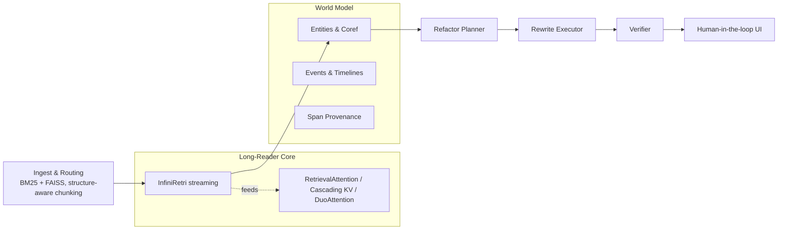
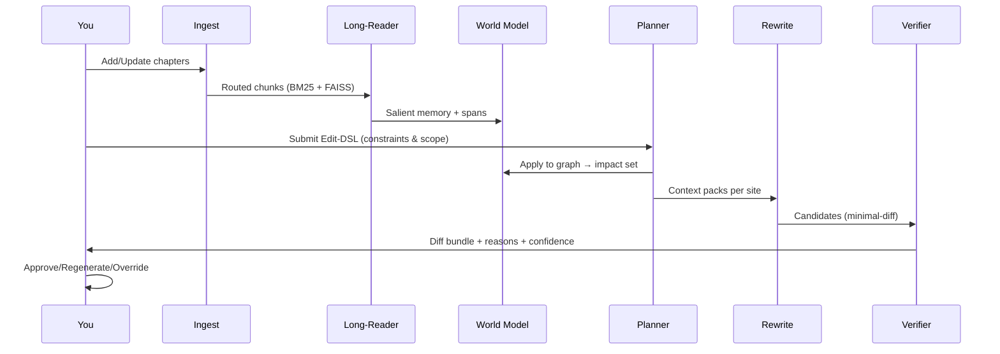

# CoRE — Continuity Refactor Engine

*A practical architecture for global, document‑scale, semantically consistent refactoring of long narratives*

<p align="center">
  <a href="#why-core"></a>
  <a href="#installation"></a>
  <a href="#license"></a>
  <a href="#references"></a>
</p>

> **TLDR:** Given a very long manuscript and a high‑level change (e.g., “Marisol is Peruvian, not French”), **CoRE** finds all impacted spans, plans ripple effects, proposes minimal, style‑preserving rewrites under **global constraints**, and **verifies** factual/temporal consistency and spoiler safety before you hit *merge*.

---

## Table of Contents

* [Why CoRE?](#why-core)
* [What CoRE Solves](#what-core-solves)
* [How It Works (Architecture)](#how-it-works-architecture)
* [Quickstart](#quickstart)
* [Concepts](#concepts)
* [Editing Workflow](#editing-workflow)
* [Verification & Safety](#verification--safety)
* [Evaluation](#evaluation)
* [Roadmap](#roadmap)
* [FAQ](#faq)
* [Contributing](#contributing)
* [License](#license)
* [References](#references)

---

## Why CoRE?

Long‑context LLMs are **not** a magic wand for book‑length editing: they frequently degrade as the window grows and miss mid‑context facts ("lost in the middle"). CoRE embraces a different strategy:

* **Read selectively, not endlessly.** Stream chapters, retain only salient sentences, and bring just the right knowledge to each edit. \[1, 2, 10–14]
* **Treat edits as first‑class changes.** Model them as **constrained decoding** with global invariants and a plan for narrative ripples. \[5, 8]
* **Keep a world model.** Represent entities, events, and timelines with span‑level provenance so you can trace *why* a change was made. \[3, 4, 15]
* **Verify before merge.** Lightweight NLI and discourse‑aware checks, RAG contradiction guards, and spoiler detectors act as safety rails. \[6, 7, 9, 16]

> **Outcome:** Global, document‑scale edits that are auditable, minimal‑diff, voice‑preserving, and spoiler‑aware.

---

## What CoRE Solves

| Pain Point                                        | Why it matters                                                                                                                                | CoRE’s Answer                                                                                                                                 |
| ------------------------------------------------- | --------------------------------------------------------------------------------------------------------------------------------------------- | --------------------------------------------------------------------------------------------------------------------------------------------- |
| Global ripple effects from a small profile change | A single nationality or backstory tweak can impact passports, idioms, visas, cuisine, family history, and timelines across hundreds of pages. | **Refactor Planner** computes the impact set from a declarative **Edit‑DSL** and a graph‑based **World Model** (entities, events, timelines). |
| Long‑context brittleness and memory blow‑ups      | Big windows often under‑perform and are costly.                                                                                               | **Training‑free long‑reader** (InfiniRetri) + **RetrievalAttention / KV caching** read effectively at book scale without retraining.          |
| Style drift and over‑editing                      | Global rewrites can mangle voice.                                                                                                             | **Constraint‑aware decoding** targets *minimal‑diff* patches with style preservation constraints.                                             |
| Silent contradictions and spoilers                | Unverified patches can introduce factual/temporal errors or leak twists.                                                                      | **Verifier** runs NLI consistency, discourse checks, RAG contradiction tests, and **spoiler filters** before merge.                           |
| Lack of traceability                              | Editors need to see every reason and source span.                                                                                             | Git‑style diffs, per‑patch *reason tags*, confidence, and full span provenance.                                                               |

---

## How It Works (Architecture)



### Core Responsibilities

1. **Understand** → build/maintain the **World Model** (entities, attributes, relations; events with temporal order) with span provenance. \[3]
2. **Plan** → apply an **Edit Specification** (DSL) and compute the **impact set** (direct + implied ripples), scoped by acts/POVs with spoiler guards.
3. **Edit** → generate **minimal‑diff** patches using **constraint‑aware decoding** that satisfy global constraints (facts, tone, timeline). \[8]
4. **Verify** → run NLI/discourse consistency, contradiction checks (for multi‑source inputs), and **spoiler** filters; only then propose diffs. \[6, 7, 9]
5. **Orchestrate** → surface git‑style diffs with reasons, confidence, and audit trails.

> **Evidence basis:** Long‑window weaknesses \[1, 14], training‑free efficiency \[2, 10–13], event‑centric reasoning \[3, 4], document‑level editing difficulty \[5], verification efficacy \[6, 7, 9, 16].

---

## Quickstart

> **Status:** Reference implementation layout below; adapt to your stack. CoRE intentionally favors **training‑free** components that work with common open‑weights.

### Installation

```bash
# Clone
git clone https://github.com/your-org/core.git
cd core

# Create environment (choose one)
python -m venv .venv && source .venv/bin/activate
# or: uv venv && source .venv/bin/activate

# Install (editable + extras)
pip install -e .[all]

# Optional: FAISS / torch with CUDA
# See PyTorch + FAISS installation pages for your platform
```

### Project Layout (reference)

```
core/
├─ core/                    # library code
│  ├─ ingest/               # structure-aware chunking, BM25, FAISS
│  ├─ longreader/           # InfiniRetri + retrieval/kv accelerators
│  ├─ world/                # entities, coref, events, timelines
│  ├─ plan/                 # impact set planner (Edit-DSL → graph)
│  ├─ edit/                 # constraint-aware decoding, patching
│  ├─ verify/               # NLI, discourse, contradiction, spoilers
│  └─ ui/                   # diff bundles, reason tags, approvals
├─ configs/
├─ examples/
└─ scripts/
```

### Minimal Example

```bash
# 1) Index your manuscript (markdown/chapters)
core ingest --root ./my_book --out ./data/index

# 2) Build world model (entities, events, timelines)
core world build --index ./data/index --out ./data/world

# 3) Submit an Edit-DSL spec
core plan --dsl edits/marisol.yaml --world ./data/world --out ./data/plan

# 4) Generate minimal-diff patches under constraints
core edit apply --plan ./data/plan --out ./data/patches

# 5) Verify consistency & spoilers; produce a diff bundle
core verify --patches ./data/patches --world ./data/world --out ./out/diff_bundle
```

### Edit‑DSL (declarative)

```yaml
edit:
  type: CharacterProfileUpdate
  target: "Marisol Vega"
  changes:
    nationality: "Peruvian"         # was "French"
    add_traits: ["compulsively punctual"]
    remove_traits: ["chain-smoker"]
  scope:
    acts: [1, 2]                    # do not touch Act 3 (twist)
    viewpoints: ["narrator", "Tomas"]
  invariants:
    - "keeps heirloom locket"
    - "parents met in Lima"
  policy:
    rewrite: "minimal-diff"
    voice: "preserve-local-style"
```

---

## Concepts

### Long‑Reader Core (training‑free)

* **InfiniRetri loop:** stream chapters in 1–2K token chunks; use final‑layer attention to select **top‑K salient sentences**, carry them forward as compact memory → effectively “infinite” read at bounded cost. \[2]
* **Acceleration knobs:**

  * **RetrievalAttention** → index past KV, fetch \~1–3% most relevant keys per step with near‑full accuracy. \[10]
  * **Cascading KV Cache** → multi‑tier caches; linear prefill scaling at \~1M effective tokens. \[11, 12]
  * **DuoAttention** → keep full KV for retrieval heads; constant‑length cache for streaming heads. \[13]

> **Why:** Long‑window models degrade with length and mid‑context info is often under‑used; selective streaming is more robust and cost‑effective. \[1, 14]

### World Model (story “bible”)

* **Entities & Coreference:** book‑scale coref with span links to every assertion; use BOOKCOREF insights for evaluation and tuning. \[15]
* **Events & Timelines:** event tuples (who‑did‑what‑when‑where) with causal/temporal links and provenance; **EventRAG** schema compatible. \[3]
* **Narrative Trails (optional):** coherence‑optimized storyline paths to plan ripple effects. \[4]

### Refactor Planner

* Applies the Edit‑DSL to the graph; computes **impact set** including direct assertions (e.g., passports) and **entailed cues** (idioms, cuisine, visas). \[3]
* Respects **scope** (acts/chapters/POVs) and spoiler masks.

### Rewrite Executor (constraint‑aware)

* Packages local scene + long‑reader memory + character card + derived constraints.
* Uses **DeepEdit‑style** guided decoding to produce **minimal‑diff** patches that satisfy local + global constraints; ranks candidates by constraint/NLI/style. \[8]

### Verifier

* **NLI consistency** (SummaC baseline) local + doc‑level. \[6]
* **Discourse‑aware** scoring for long‑doc contradictions. \[7]
* **RAG contradiction** check if multiple sources were retrieved. \[9]
* **Spoiler detection** (genre‑aware MMoE). \[16]

---

## Editing Workflow



> CoRE always surfaces *why* a span changed and *which evidence* supports it.

---

## Verification & Safety

* **Pre‑merge gates:** edits must pass NLI and discourse‑aware checks; RAG contradiction guard blocks conflicting evidence; spoilers flagged with override option. \[6, 7, 9, 16]
* **Auditability:** every KG node and patch retains span‑level provenance; diff bundles are grouped by **reason tags** (e.g., *nationality ripple → passport*).
* **Voice preservation:** constraints include style similarity and punctuation rhythm to avoid over‑editing.

---

## Evaluation

CoRE is research‑grounded and **measurable**:

* **Reading at scale:** RULER / OneRULER + needle‑in‑haystack; track accuracy vs. context growth. \[14]
* **Entity tracking:** BOOKCOREF (CoNLL‑F1) on representative long‑form texts. \[15]
* **Edit quality:** DocMEdit‑style multi‑fact updates; minimal‑diff ratio; blind human ratings for voice/continuity. \[5]
* **Consistency & safety:** SummaC scores; discourse‑driven contradictions; RAG context stress tests; spoiler precision/recall on twist‑heavy chapters. \[6, 7, 9, 16]

<details>
  <summary><strong>Repro scripts (suggested)</strong></summary>

```bash
scripts/bench_ruler.sh         # long-context reading stability
scripts/bench_bookcoref.sh     # entity/coref evaluation
scripts/bench_docmedit.sh      # document-level edit benchmark
scripts/bench_consistency.sh   # NLI + discourse + contradiction
```

</details>

---

## Roadmap

* [x] Ingest & routing (BM25 + FAISS); structure‑aware chunking
* [x] InfiniRetri long‑reader with span provenance \[2]
* [x] Edit‑DSL v0 and impact‑set planner
* [x] Minimal‑diff, constraint‑aware rewrites \[8]
* [x] NLI‑based verification (SummaC) \[6]
* [ ] Discourse‑aware inconsistency scoring \[7]
* [ ] RAG contradiction gate w/ model‑agnostic prompts \[9]
* [ ] Spoiler classifier (genre‑aware MMoE) \[16]
* [ ] Narrative Trails for arc‑aware planning \[4]
* [ ] DuoAttention/Cascading KV integration for latency \[11–13]
* [ ] Full UI: diff bundles, reasons, approvals

---

## FAQ

**How is this different from “just use a 1M‑token model and prompt it”?**
Long windows are expensive and empirically brittle, especially for mid‑context facts. CoRE streams and selects only what matters, then edits under constraints with verification. \[1, 14]

**Can I use my favorite open‑weights?**
Yes. CoRE’s long‑reader and decoders are **training‑free**. If your model exposes attentions/KV, you’re good. \[2, 10–13]

**Will it change my voice?**
The executor targets **minimal‑diff** patches and enforces style similarity; you can dial constraints tighter or looser.

**What about spoilers?**
Edits are gated by a spoiler detector and can be scoped by act/POV to avoid leaking twists. \[16]

**Does it support non‑fiction?**
Yes—world modeling still helps (entities/events/timelines), and verification is even more valuable for factual consistency.

---

## Contributing

We welcome issues and PRs! Please:

1. Read `CONTRIBUTING.md`.
2. Run `pre-commit` hooks and add tests.
3. Include before/after diffs and a short rationale (*reason tags*).

<details>
  <summary><strong>Developer setup</strong></summary>

```bash
pip install -r requirements-dev.txt
pre-commit install
pytest -q
```

</details>

---

## License

MIT. See `LICENSE`.

---

## Citation

If you use CoRE in academic work, please cite this repository and the motivating papers below.

```bibtex
@software{core2025,
  title        = {CoRE: Continuity Refactor Engine},
  author       = {Your Name and Contributors},
  year         = {2025},
  url          = {https://github.com/your-org/core}
}
```

---

## References

**Long‑context efficiency & behavior**
\[1] *Lost in the Middle: How Language Models Use Long Contexts* — arXiv.
\[2] *Infinite Retrieval: Attention Enhanced LLMs in Long ...* — arXiv.
\[10] *RetrievalAttention: Accelerating Long‑Context LLM ...* — arXiv.
\[11] *Training‑Free Exponential Context Extension ...* — arXiv.
\[12] *Training Free Exponential Context Extension via ...* — OpenReview.
\[13] *DuoAttention: Efficient Long‑Context LLM Inference ...* — arXiv.
\[14] *RULER: What’s the Real Context Size of Your Long‑Context LLMs?* — arXiv.

**Document‑level editing**
\[5] *DocMEdit: Towards Document‑Level Model Editing* — arXiv.
\[8] *DeepEdit: Knowledge Editing as Decoding with Constraints* — arXiv.

**Narrative world modeling**
\[3] *Enhancing LLM Generation with Event Knowledge Graphs* — ACL Anthology.
\[4] *Narrative Trails: Coherent Storyline Extraction via Maximum Capacity Paths* — arXiv.
\[15] *BOOKCOREF: Coreference Resolution at Book Scale* — ACL Anthology.

**Consistency & spoiler safety**
\[6] *SummaC: Re‑Visiting NLI‑based Models for Inconsistency ...* — ACL Anthology.
\[7] *Unveiling Factual Inconsistency in Long Document ...* — arXiv.
\[9] *Contradiction Detection in RAG Systems ...* — arXiv.
\[16] *MMoE: Robust Spoiler Detection with Multi‑ ...* — arXiv.

> Full URLs are preserved in the source design and can be mirrored in a `docs/references.md` if desired.
