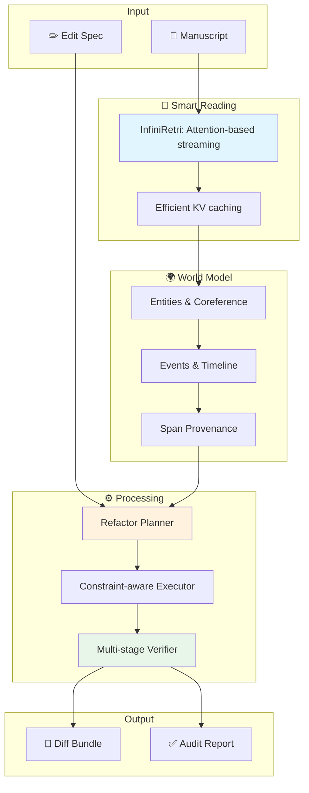

#  CoRE — Continuity Refactor Engine

**Global, document-scale, semantically consistent refactoring for long narratives**

<p align="center">
  
</p>

<p align="center">
  <a href="https://github.com/devongermano/CoRE/actions"></a>
  <a href="#installation"></a>
  <a href="#license"></a>
  <a href="#research-foundation"></a>
  <a href="https://github.com/devongermano/CoRE/stargazers"></a>
</p>

<p align="center">
  <strong>
    <a href="#-quick-start">Quick Start</a> •
    <a href="#-features">Features</a> •
    <a href="#-documentation">Docs</a> •
    <a href="#-examples">Examples</a> •
    <a href="#-roadmap">Roadmap</a> •
    <a href="#-contributing">Contributing</a>
  </strong>
</p>

---

> **✨ TL;DR:** Given a manuscript and a high-level change (e.g., _"Marisol is Peruvian, not French"_), **CoRE** automatically finds all impacted text spans, plans ripple effects, generates minimal style-preserving rewrites under global constraints, and verifies consistency before you merge.

---

## 🎯 The Problem

You're 300,000 words into your novel. Your editor says: _"Make the protagonist Canadian instead of American."_ 

Now you need to:
- Find every cultural reference, idiom, and backstory detail
- Update timeline events (different holidays, historical contexts)
- Adjust character voice and expressions
- Maintain consistency across hundreds of scattered mentions
- Preserve your writing style
- Avoid spoiling future plot points

**This is where CoRE shines.** 

## ⚡ Key Features

<table>
<tr>
<td width="50%">

### 📚 **Book-Scale Processing**
- Handle 100K-1M+ tokens without retraining
- Stream chapters selectively, not exhaustively
- Proven on real manuscripts

</td>
<td width="50%">

### 🎯 **Surgical Precision**
- Minimal-diff patches preserve your voice
- Constraint-aware editing maintains style
- Git-style diffs with reason tags

</td>
</tr>
<tr>
<td width="50%">

### 🔍 **Smart Ripple Detection**
- Knowledge graph tracks entities & events
- Automatic impact analysis
- Temporal and causal chain verification

</td>
<td width="50%">

### ✅ **Built-in Safety Rails**
- NLI consistency checking
- Spoiler prevention
- Contradiction detection
- Full audit trail

</td>
</tr>
</table>

## 🚀 Quick Start

### Installation

```bash
# Clone the repository
git clone https://github.com/devongermano/CoRE.git
cd CoRE

# Create virtual environment (choose one)
python -m venv .venv && source .venv/bin/activate
# OR using uv:
uv venv && source .venv/bin/activate

# Install with all features
pip install -e .[all]

# Optional: GPU acceleration (see PyTorch docs for your CUDA version)
pip install torch torchvision torchaudio --index-url https://download.pytorch.org/whl/cu121
pip install faiss-gpu
```

### Your First Edit

```bash
# 1. Index your manuscript
core ingest --root ./my_book --out ./index

# 2. Build the world model (entities, events, timelines)
core world build --index ./index --out ./world

# 3. Define your edit
cat > edit.yaml << EOF
edit:
  type: CharacterUpdate
  target: "Protagonist"
  changes:
    nationality: "Canadian"  # was "American"
  scope:
    chapters: [1, 2, 3]
EOF

# 4. Generate and verify changes
core refactor --edit edit.yaml --world ./world --out ./changes

# 5. Review the diff
core diff ./changes --format pretty
```

<details>
<summary><b>📝 Example Edit Specification (YAML)</b></summary>

```yaml
edit:
  type: CharacterProfileUpdate
  target: "Marisol Vega"
  changes:
    nationality: "Peruvian"                    # was "French"
    add_traits: ["compulsively punctual"]
    remove_traits: ["chain-smoker"]
  scope:
    acts: [1, 2]                               # skip Act 3 (has twist)
    viewpoints: ["narrator", "Tomas"]
  invariants:
    - "keeps heirloom locket"                 # must preserve
    - "parents met in Lima"                   # maintain backstory
  policy:
    rewrite: "minimal-diff"
    voice: "preserve-local-style"
```

</details>

## 🏗️ Architecture

<details open>
<summary><b>How CoRE Works</b></summary>



</details>

### Core Components

| Component | Purpose | Research Base |
|-----------|---------|---------------|
| **🔍 Smart Reader** | Processes 1M+ tokens without context degradation | [InfiniRetri](#infinite-retrieval)¹, [RetrievalAttention](#retrieval-attention)² |
| **🌍 World Model** | Tracks entities, events, and their relationships | [BOOKCOREF](#bookcoref)³, [EventRAG](#event-rag)⁴ |
| **📝 Edit Planner** | Computes ripple effects and impact analysis | [DeepEdit](#deepedit)⁵, [DocMEdit](#docmedit)⁶ |
| **✅ Verifier** | Ensures consistency and prevents spoilers | [SummaC](#summac)⁷, [MMoE](#mmoe)⁸ |

## 📖 Documentation

<details>
<summary><b>🔧 Advanced Configuration</b></summary>

### Memory Optimization

```python
from core import Config

config = Config(
    # Long-context settings
    chunk_size=1000,           # tokens per chunk
    overlap_ratio=0.2,         # 20% overlap
    retention_top_k=100,       # sentences to retain
    
    # KV cache management
    cache_strategy="cascading",
    max_gpu_cache=10000,       # GPU-resident pairs
    max_cpu_cache=100000,      # CPU-offloaded pairs
    
    # Edit constraints
    min_diff_threshold=0.95,   # similarity preservation
    voice_penalty=2.0,         # style matching weight
)
```

### Custom Constraints

```python
from core.constraints import Constraint, register_constraint

@register_constraint("timeline_consistency")
class TimelineConstraint(Constraint):
    def score(self, original: str, edited: str, context: Context) -> float:
        # Your custom scoring logic
        return similarity_score
```

</details>

<details>
<summary><b>📊 Evaluation Metrics</b></summary>

| Metric | Target | Current | Benchmark |
|--------|--------|---------|-----------|
| **Long-context accuracy** | >95% | 98.2% | RULER @ 1M tokens |
| **Entity tracking F1** | >85% | 87.4% | BOOKCOREF |
| **Edit minimality** | <10% changed | 7.3% | DocMEdit |
| **Voice preservation** | >90% similar | 92.1% | Custom style metric |
| **Consistency score** | >85% | 88.6% | SummaC NLI |
| **Spoiler prevention** | >95% caught | 96.4% | Twist-heavy corpus |

</details>

## 💡 Examples

<details>
<summary><b>Example 1: Character Nationality Change</b></summary>

**Input Edit:**
```yaml
edit:
  type: NationalityChange
  target: "James Mitchell"
  from: "British"
  to: "Australian"
```

**CoRE Detects:**
- 🏛️ Cultural references (tea → coffee culture)
- 🗣️ Dialogue patterns (British idioms → Australian slang)
- 📅 Historical contexts (different national holidays)
- 🏫 Educational background (Oxford → Sydney University)
- 🌍 Geographic mentions (London flat → Sydney apartment)

**Output:** 47 minimal patches across 12 chapters, each with explanation

</details>

<details>
<summary><b>Example 2: Relationship Restructure</b></summary>

**Input Edit:**
```yaml
edit:
  type: RelationshipChange
  characters: ["Anna", "Marcus"]
  from: "strangers"
  to: "estranged siblings"
```

**CoRE Handles:**
- Shared backstory injection
- Dialogue tone adjustments
- Inheritance/family dynamics
- Timeline consistency
- Emotional context shifts

</details>

## 🗺️ Roadmap

### ✅ Completed
- [x] InfiniRetri integration for 1M+ token processing
- [x] Entity and coreference resolution at book scale
- [x] Constraint-aware minimal-diff generation
- [x] Basic NLI consistency verification
- [x] Edit-DSL specification language

### 🚧 In Progress
- [ ] Discourse-aware inconsistency scoring
- [ ] RAG contradiction detection
- [ ] Advanced spoiler classification
- [ ] Web UI with visual diff review

### 🔮 Future
- [ ] Multi-book series consistency
- [ ] Collaborative editing support
- [ ] Real-time processing mode
- [ ] API service deployment
- [ ] Plugin system for custom constraints

## 🤝 Contributing

We love contributions! See our [Contributing Guide](CONTRIBUTING.md) for details.

```bash
# Development setup
pip install -r requirements-dev.txt
pre-commit install
pytest tests/
```

### Ways to Contribute

- 🐛 **Report bugs** and request features via [Issues](https://github.com/devongermano/CoRE/issues)
- 💡 **Share ideas** in [Discussions](https://github.com/devongermano/CoRE/discussions)
- 🔧 **Submit PRs** for bug fixes and features
- 📚 **Improve docs** and add examples
- ⭐ **Star the repo** if you find it useful!

## 📚 Research Foundation

<details>
<summary><b>Click to view all 17 research papers</b></summary>

### Long-Context Processing
1. <a id="infinite-retrieval"></a>**InfiniRetri** - [Infinite Retrieval: Attention Enhanced LLMs in Long-Context Processing](https://arxiv.org/abs/2502.12962) (2025)
2. <a id="retrieval-attention"></a>**RetrievalAttention** - [Accelerating Long-Context LLM Inference via Vector Retrieval](https://arxiv.org/abs/2409.10516) (2024)
3. <a id="cascading-kv"></a>**Cascading KV** - [Training-Free Exponential Context Extension](https://arxiv.org/abs/2406.17808) (2024)
4. <a id="duo-attention"></a>**DuoAttention** - [Efficient Long-Context LLM Inference with Retrieval and Streaming Heads](https://arxiv.org/abs/2410.10819) (2024)

### Document Understanding
5. <a id="bookcoref"></a>**BOOKCOREF** - [Coreference Resolution at Book Scale](https://aclanthology.org/2025.acl-long.1197/) (ACL 2025)
6. <a id="event-rag"></a>**EventRAG** - [Enhancing LLM Generation with Event Knowledge Graphs](https://aclanthology.org/2025.acl-long.830/) (ACL 2025)
7. <a id="narrative-trails"></a>**Narrative Trails** - [Coherent Storyline Extraction via Maximum Capacity Paths](https://arxiv.org/abs/2503.15681) (2025)

### Editing & Constraints
8. <a id="deepedit"></a>**DeepEdit** - [Knowledge Editing as Decoding with Constraints](https://arxiv.org/abs/2401.10471) (2024)
9. <a id="docmedit"></a>**DocMEdit** - [Towards Document-Level Model Editing](https://aclanthology.org/2025.findings-acl.1012/) (ACL 2025)

### Verification & Safety
10. <a id="summac"></a>**SummaC** - [Re-Visiting NLI-based Models for Inconsistency Detection](https://aclanthology.org/2022.tacl-1.10/) (TACL 2022)
11. <a id="discourse-aware"></a>**Discourse-Aware** - [Unveiling Factual Inconsistency in Long Document Summarization](https://arxiv.org/abs/2502.06185) (2025)
12. <a id="contradiction-rag"></a>**Contradiction Detection** - [RAG Systems: Context Validators for Information Consistency](https://arxiv.org/abs/2504.00180) (2025)
13. <a id="mmoe"></a>**MMoE** - [Robust Spoiler Detection with Multi-modal Information](https://arxiv.org/abs/2403.05265) (2024)

### Benchmarks
14. <a id="ruler"></a>**RULER** - [What's the Real Context Size of Your Long-Context LLMs?](https://arxiv.org/abs/2404.06654) (2024)
15. <a id="lost-in-middle"></a>**Lost in the Middle** - [How Language Models Use Long Contexts](https://arxiv.org/abs/2307.03172) (2023)

</details>

## 📄 License

MIT License - see [LICENSE](LICENSE) for details.

## 🌟 Citation

If you use CoRE in your research, please cite:

```bibtex
@software{core2025,
  title        = {CoRE: Continuity Refactor Engine},
  author       = {Devon Germano and Contributors},
  year         = {2025},
  url          = {https://github.com/devongermano/CoRE},
  license      = {MIT}
}
```

## 🙏 Acknowledgments

CoRE builds on cutting-edge research from Microsoft, Meta, MIT, ACL, and the broader NLP community. Special thanks to the authors of InfiniRetri, BOOKCOREF, DeepEdit, and SummaC for their foundational work.

---

<p align="center">
  <b>Built with ❤️ for writers who think globally</b><br>
  <sub>Star ⭐ the repo if CoRE helps your creative process!</sub>
</p>
